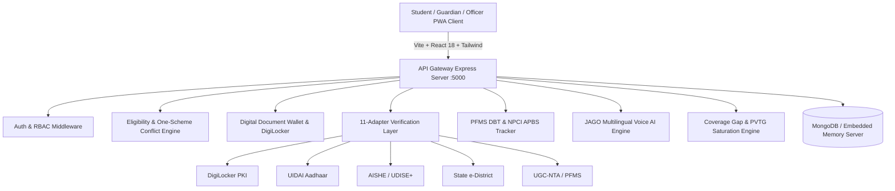

# Unified Scholarship Mobile Application for Tribal Students
### Ministry of Tribal Affairs (MoTA), Government of India 🇮🇳

[](https://opensource.org/licenses/MIT)
[](https://reactjs.org/)
[](https://www.meity.gov.in/)
[-brightgreen.svg)]()

---

## 📖 Executive Summary & Problem Solved

Scheduled Tribe (ST) students across India historically had to navigate three disconnected portals:
1. **National Scholarship Portal (NSP)** — for Pre-Matric and Post-Matric schemes.
2. **SFMP / Canara Bank Portal** — for National Fellowship for ST (NFST).
3. **Standalone NOS Portal** — for National Overseas Scholarship.

### Key Pain Points Solved:
1. **Unified Single-Window Discovery**: One mobile-first Progressive Web App (PWA) uniting all 5 official MoTA scholarship schemes.
2. **One-Scholarship-at-a-Time Enforcement**: Real-time cross-scheme duplicate claim prevention to adhere strictly to Central Government financial rules.
3. **Digital Document Wallet & Non-Blocking Verification**: Reusable digital vault with 1-click **DigiLocker** integration and 11 pluggable automated verification adapters. Verification timeouts never block student application submissions.
4. **End-to-End DBT Transparency**: Real-time PFMS transaction ledger with sanction orders, transaction IDs, bank UTR numbers, and NPCI Aadhaar seeding health checks.
5. **JAGO (जागो) Multilingual AI Voice Assistant**: Context-aware assistant with Speech-to-Text (STT) and Text-to-Speech (TTS) support in 6 Indian languages + tribal cultural greetings (*Johar!*).
6. **Officer Console & Tribal Coverage Gap Engine**: Three-tier operational console for Institute, State, and MoTA Central Administrators with demographic saturation analytics for PVTG communities and high-dropoff districts.

---

## 🏛️ All 5 Official MoTA Schemes

| Scheme Code | Full Scheme Name | Target Cohort | Income Ceiling | Key Financial Benefits |
| :--- | :--- | :--- | :--- | :--- |
| `PRE_MATRIC` | **Pre-Matric Scholarship for ST Students** | Class IX & X in Govt / EMRS schools | $\le$ ₹2.50 Lakh / yr | Day Scholar: ₹3,500/yr • Hosteller: ₹7,000/yr + 10% Divyang grant |
| `POST_MATRIC` | **Post-Matric Scholarship for ST Students** | Class XI to Post-Doctoral | $\le$ ₹2.50 Lakh / yr | Full compulsory fees + ₹2,500 to ₹13,500/yr maintenance allowance |
| `TOP_CLASS` | **National Scholarship for Higher Education (Top Class)** | 246 Notified Premier Institutes (IITs, IIMs, AIIMS, NITs, NLUs) | $\le$ ₹6.00 Lakh / yr | Full tuition + ₹36,000/yr living expenses + ₹5,000 books + **₹45,000 laptop grant** |
| `NFST` | **National Fellowship for ST Students** | M.Phil & Ph.D Scholars in UGC Universities | Purely Merit-Based (No Income Cap) | JRF: ₹31,000/mo • SRF: ₹35,000/mo + HRA + ₹10,000-₹12,000/yr contingency |
| `NOS` | **National Overseas Scholarship for ST Students** | Master's & Ph.D in Top 500 QS World Universities | $\le$ ₹6.00 Lakh / yr | Full foreign tuition + USD 15,400/yr (USA) or GBP 9,900/yr (UK) + airfare & visa |

---

## 🏗️ System Architecture



---

## 🛡️ DPDP Act 2023 Privacy & Security Architecture

- **Zero Raw Aadhaar Leakage**: Full 12-digit Aadhaar numbers are **never stored** in database or transmitted in plain text. Only `aadhaarLast4` and irreversible SHA-256 HMAC tokens are recorded.
- **Field-Level Encryption**: Sensitive banking tokens and account numbers are encrypted at rest using **AES-256-GCM** with authenticated 128-bit tags.
- **Cookie Security**: JWT tokens are delivered in `httpOnly`, `sameSite: 'lax'`, and `secure` cookies with rate-limiting and helmet security headers.
- **Statutory Conflict Prevention**: Strict database state machine prevents simultaneous concurrent scholarship awards.

---

## 👥 9 Demo Personas (1-Click Switcher)

The application includes an instant 1-click persona switcher in the top navigation bar to evaluate all roles and scheme states without typing credentials:

| Persona Key | Name | Role | Profile Context & Scheme State |
| :--- | :--- | :--- | :--- |
| `student_prematric` | Birsa Munda Jr. | Student | Class IX, EMRS Sundargarh (Pre-Matric eligible, ₹1.2L income) |
| `student_postmatric` | Rani Durgavati Gond | Student | B.Sc Nursing, Govt Medical College Jabalpur (Post-Matric draft) |
| `student_topclass` | Jaipal Singh Munda | Student | B.Tech CSE, IIT Bombay (Top Class, Divyang, ₹86,000 DBT disbursed) |
| `student_nfst` | Shanti Birhor Soren | Student | Ph.D Anthropology, Utkal Univ (PVTG Birhor, open deficiency query) |
| `student_nos` | Mangal Oraon | Student | M.Sc Renewable Energy, Univ of Oxford (NOS Overseas candidate) |
| `guardian` | Somra Munda | Guardian | Parent of Birsa Munda Jr. (Family ward monitoring view) |
| `institute_nodal` | Prof. A. K. Meena | Officer | Nodal Officer, IIT Bombay (AISHE `U-0306` verification queue) |
| `state_nodal` | Rajeshwar Hembram | Officer | Deputy Director, Odisha Tribal Welfare Directorate (State scrutiny) |
| `mota_admin` | Dr. Rameshwar Oraon | Admin | MoTA Central Admin, Shastri Bhawan, New Delhi (National sanctions & DBT) |

---

## 🚀 Quick Start & Installation

### Option 1: Zero-Config Local Run (Node.js)

The backend automatically starts a zero-config embedded MongoDB server if no local MongoDB instance is active.

```bash
# 1. Clone repository
git clone https://github.com/mota-tribal/unified-scholarship-portal.git
cd unified-scholarship-portal

# 2. Start Backend API Server
cd server
npm install
npm run dev

# 3. Start Frontend Client (in a separate terminal)
cd ../client
npm install
npm run dev
```

- Open **Frontend App**: `http://localhost:5173`
- Backend API Health Check: `http://localhost:5000/api/v1/health`

### Option 2: Docker Compose Deployment

```bash
docker-compose up --build
```

---

## 🧪 Master Test Suite Execution

Run all 15 master integration test assertions covering all 6 phases:

```bash
cd server
node test_all_phases.js
```

Run the statutory DPDP Act 2023 cryptographic security audit:

```bash
cd server
node test_security_dpdp.js
```

---

## 📂 Project Directory Structure

```
Website/
├── docker-compose.yml              # Root Docker multi-container orchestration
├── .env.example                    # Environment variable templates
├── README.md                       # Master documentation & deployment guide
├── client/                         # React 18 + Vite Progressive Web App (PWA)
│   ├── public/
│   │   ├── manifest.json           # PWA Web App Manifest
│   │   ├── sw.js                   # Production Service Worker & Offline Cache
│   │   ├── icon-192.svg            # 192x192 SVG App Icon
│   │   ├── icon-512.svg            # 512x512 SVG App Icon
│   │   └── favicon.svg             # Browser Favicon
│   ├── src/
│   │   ├── components/
│   │   │   ├── Header.jsx          # Top bar with Language Selector & Demo Switcher
│   │   │   ├── BottomNav.jsx       # Mobile bottom navigation
│   │   │   ├── OfflineBanner.jsx   # PWA offline state banner
│   │   │   ├── JagoChatDrawer.jsx  # JAGO AI Voice & Multilingual Assistant
│   │   │   ├── DigiLockerModal.jsx # 1-Click DigiLocker certificate sync
│   │   │   ├── ApplicationTimeline.jsx # 5-Stage visual progress timeline
│   │   │   ├── PendingActionsPanel.jsx # Action prioritization queue
│   │   │   ├── NotificationsDrawer.jsx # Multi-channel notification center
│   │   │   └── VerificationQueueDrawer.jsx # Officer review queue
│   │   ├── context/
│   │   │   ├── AuthContext.jsx     # Authentication & Demo Role state
│   │   │   └── LanguageContext.jsx # Multilingual context (EN, HI, OR, BN, MR, TE)
│   │   ├── pages/
│   │   │   ├── DashboardPage.jsx   # Unified 5-scheme student dashboard
│   │   │   ├── SchemesPage.jsx     # Config-driven scheme directory & rules
│   │   │   ├── ApplicationWizardPage.jsx # 5-Step auto-saving application wizard
│   │   │   ├── DocumentWalletPage.jsx    # Digital document repository
│   │   │   ├── PaymentsTrackerPage.jsx   # PFMS DBT disbursement tracker
│   │   │   ├── GrievancePage.jsx         # Support tickets & MoTA helpline
│   │   │   ├── OfficerConsolePage.jsx    # Institute/State/MoTA operational console
│   │   │   ├── GuardianWardsPage.jsx     # Family ward linking & monitoring
│   │   │   ├── ProfilePage.jsx           # Student academic & tribal profile
│   │   │   └── LoginPage.jsx             # OTP & demo login page
│   │   ├── services/
│   │   │   └── api.js              # Centralized Axios API client
│   │   ├── App.jsx                 # App routing & root providers
│   │   └── main.jsx                # React DOM root & Service Worker registration
│   └── package.json
└── server/                         # Node.js + Express + Mongoose Backend
    ├── src/
    │   ├── config/
    │   │   ├── constants.js        # Scheme codes, statuses, and course levels
    │   │   └── db.js               # MongoDB connection with embedded fallback
    │   ├── controllers/
    │   │   ├── authController.js   # OTP auth, JWT cookies & demo login
    │   │   ├── profileController.js# Student profile & guardian linking
    │   │   ├── schemeController.js # Dynamic scheme configuration
    │   │   ├── applicationController.js # Wizard, drafts, timeline & conflict engine
    │   │   ├── walletController.js # DigiLocker fetch & upload verification
    │   │   ├── paymentController.js# PFMS DBT ledger & transaction records
    │   │   ├── notificationController.js # In-app notification dispatcher
    │   │   ├── grievanceController.js    # Grievance registration & escalation
    │   │   ├── jagoController.js   # JAGO AI query processor & suggestions
    │   │   └── officerController.js# Scrutiny, sanctions, DBT batches & analytics
    │   ├── middlewares/
    │   │   ├── authMiddleware.js   # JWT authentication & RBAC guards
    │   │   ├── auditMiddleware.js  # Audit trail logger
    │   │   └── errorHandler.js     # Centralized error handler
    │   ├── models/
    │   │   ├── User.js             # User credentials & roles
    │   │   ├── Student.js          # Tribal identity, academic & encrypted bank data
    │   │   ├── Scheme.js           # Config-driven scheme parameters & rules
    │   │   ├── Institution.js      # AISHE premier & recognized institutes
    │   │   ├── Application.js      # Multi-step application dossiers & timeline
    │   │   ├── Document.js         # Digital document wallet entries
    │   │   ├── Verification.js     # Adapter verification logs & manual exceptions
    │   │   ├── Payment.js          # PFMS DBT transaction records
    │   │   ├── Notification.js     # In-app alerts
    │   │   ├── Grievance.js        # Grievance redressal tickets
    │   │   └── AuditLog.js         # Security audit trail records
    │   ├── services/
    │   │   ├── encryptionService.js    # AES-256-GCM & HMAC tokenization
    │   │   ├── eligibilityEngine.js    # Dynamic criteria & conflict evaluator
    │   │   ├── verificationAdapters.js # 11 pluggable verification adapters
    │   │   ├── jagoService.js          # JAGO domain knowledge & reasoning
    │   │   └── coverageGapEngine.js    # Tribal district demographic analytics
    │   └── seed/
    │       └── seedData.js         # Seeder for 5 schemes, 7 institutes, 9 personas
    ├── test_all_phases.js          # Master 15-point integration test suite
    ├── test_security_dpdp.js       # DPDP Act 2023 compliance audit suite
    └── package.json
```

---

## 🏛️ Statutory Declaration & Ministry Credits

Built for the **Ministry of Tribal Affairs (MoTA), Government of India**, adhering strictly to:
- Official Scheme Guidelines for Pre-Matric, Post-Matric, Top Class Education for ST Students, National Fellowship for ST (NFST), and National Overseas Scholarship (NOS).
- **Digital Personal Data Protection (DPDP) Act, 2023**.
- **Direct Benefit Transfer (DBT)** Guidelines via PFMS / Aadhaar Payment Bridge System (APBS).
